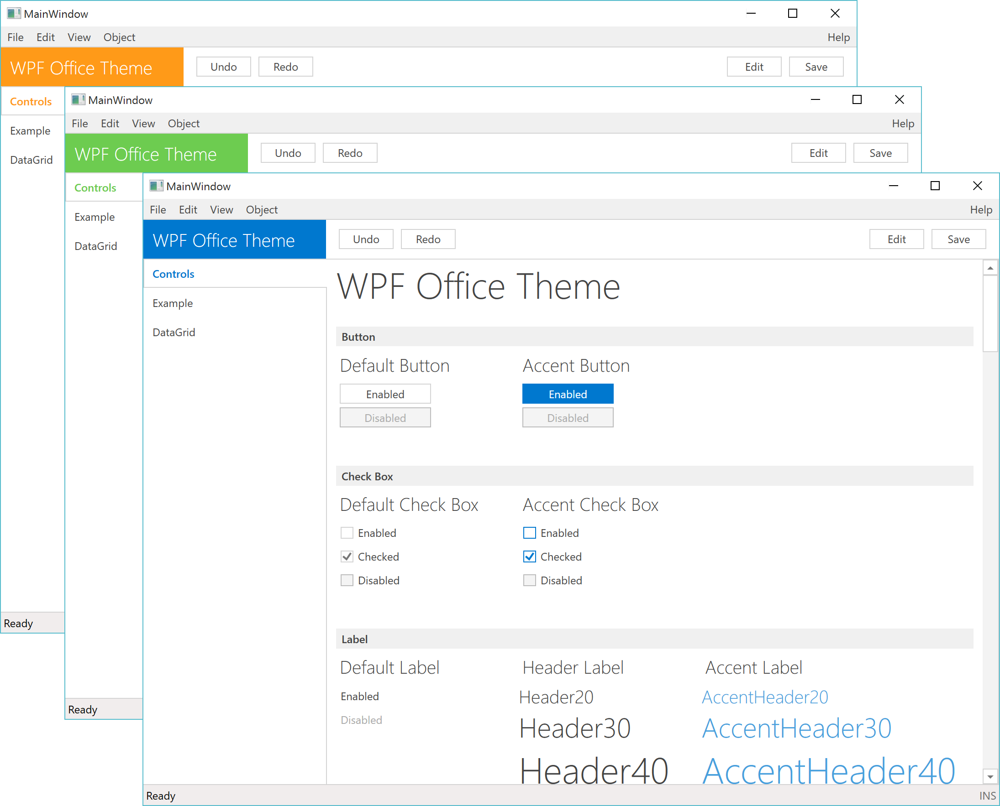

# Wpf Office Theme

### WPF theme influenced by minimalistic MS Office style



####List of supported controls
- Button
- CheckBox
- ComboBox
- Expander
- GroupBox
- Label
- ListBox
- ListView
- Menu
- RadioButton
- ScrollViewer
- TabControl
- TextBox
- ToggleButton
- TreeView
- DataGrid

####How to use that theme in your application
Download the project. Copy Themes folder to your project. 
Then you need to reference the styles in your App.xaml file. Open App.xaml and update it like following:
```
<Application
	...
	<Application.Resources>
        <ResourceDictionary>
            <ResourceDictionary.MergedDictionaries>
                <ResourceDictionary Source="/Themes/Styles/Generic.xaml"/>
            </ResourceDictionary.MergedDictionaries>
            <SolidColorBrush x:Key="AccentColorBrush" Color="#007ACC" />
        </ResourceDictionary>
    </Application.Resources>
</Application>
```
The accent color is defined dynamically. So, you need to add the code which generates the palette colors. Override the OnApplyTemplate( ) method in your main window class like following:
```
public override void OnApplyTemplate()
{
    base.OnApplyTemplate();
    var accentBrush = TryFindResource("AccentColorBrush") as SolidColorBrush;
    if (accentBrush != null) accentBrush.Color.CreateAccentColors();
}
```
That's it.

####How to change the accent color
#####Replace the accent color with the color you prefer in App.xaml
```
<SolidColorBrush x:Key="AccentColorBrush" Color="RoyalBlue" />
```
###Feedback

I hope you find it useful. Feel free to contact me for any questions you may have.
